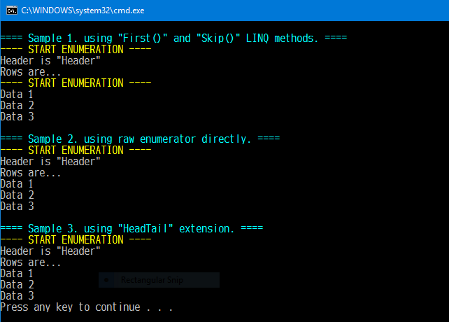

# Head/Tail sample code

## How to build and run?

### Case 1. Visual Studio 2017 or later on Windows OS

1. After clone this repository on your local disk, open "HeadTailSample.sln" solution file by Visual Studio.
2. After open it, enter Ctrl + F5 key on Visual Studio.



### Case 2. Using .NET CLI on any platforms

```bash
$ cd ~
$ git clone <this repository> headTailSample
$ cd headTailSample
$ dotnet run
```

## License

[The Unlicense (Public Domain)](LICENSE)